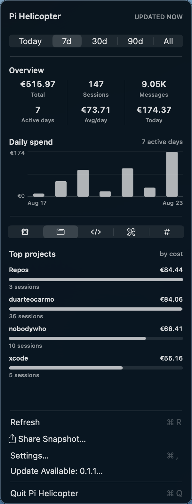

# Pi Helicopter


Pi Helicopter shows local [Pi](https://pi.dev) usage in the macOS menu bar. It reads `~/.pi/agent/sessions` locally.

Pi Helicopter is inspired by [`pi-infobar`](https://github.com/phun333/pi-infobar). It keeps the same basic menu bar idea, with a smaller interface and lower resource use.



## Features

- Shows only a pi icon in the menu bar.
- Keeps overview totals and daily spending directly below the date range.
- Shows models, projects, languages, tools, and tokens as monochrome horizontal bars.
- Breaks token usage into total, cached, input, and output.
- Filters all information by today, 7 days, 30 days, 90 days, or all time without closing the menu.
- Converts USD costs to USD, EUR, JPY, GBP, or CNY.
- Can start when you log in.

## Resource use

The app uses AppKit and Foundation. It has no third party packages, web views, Dock icon, or permanent window. The charts use small custom AppKit views, so the app does not load a chart framework.

Session files are read one line at a time. Pi Helicopter caches each parsed file and only parses files that changed. Unchanged scans reuse summaries without rewriting the cache. The menu also reuses its native views between openings. It checks for updates every five minutes and when you open the menu.

USD remains fully offline. When you select another currency, Pi Helicopter downloads the European Central Bank reference rates once per day and keeps the last rates for offline use.

## Requirements

Pi Helicopter requires macOS 13 or later and Swift 5.10 or later to build.

## Install

```sh
brew install --cask duarteocarmo/tap/pi-helicopter
```

## Build

```sh
make build
open "build/Pi Helicopter.app"
```

Run the tests with `make test`.

The build uses an ad hoc signature. macOS may ask you to confirm that you want to open the app when you move it to another Mac.
