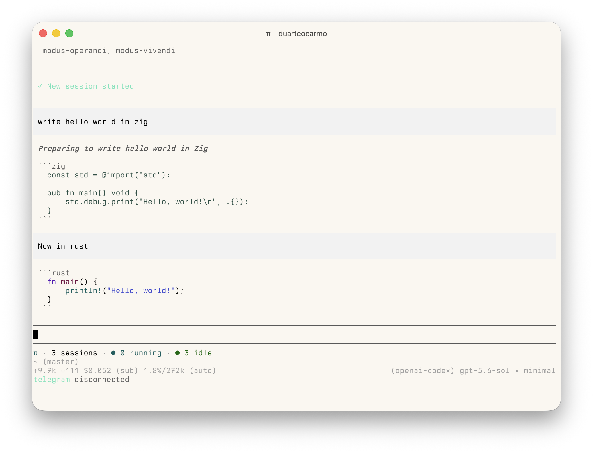
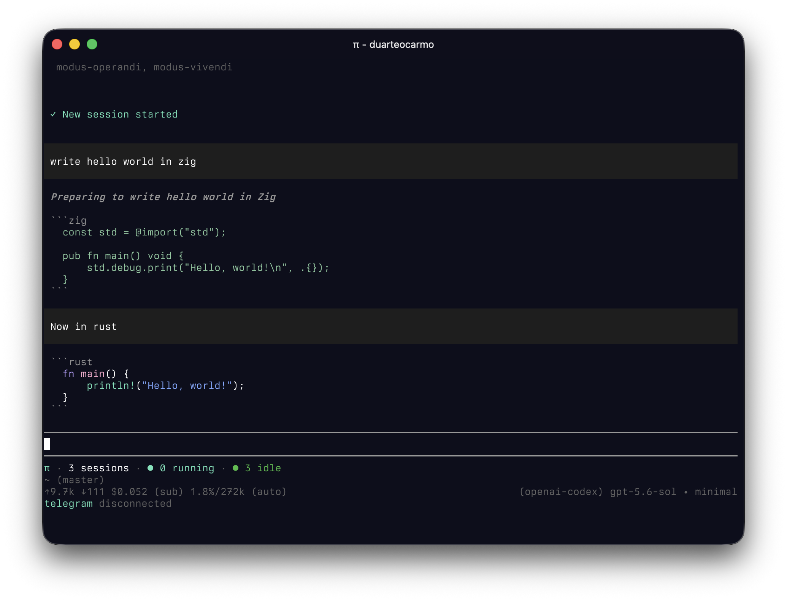

# pi-modus-themes

[](https://www.npmjs.com/package/@duarteocarmo/pi-modus-themes)
[](https://pi.dev/packages/@duarteocarmo/pi-modus-themes)

Pi Modus Themes adds light and dark Modus themes to Pi. It follows the current macOS appearance and switches themes automatically.

The themes are based on [Modus Themes](https://github.com/protesilaos/modus-themes) by Protesilaos Stavrou.

## Modus Operandi

The light variant.



## Modus Vivendi

The dark variant.



## Install

Install only Pi Modus Themes from npm:

```sh
pi install npm:@duarteocarmo/pi-modus-themes
```

Install every Pi package in this repository from Git:

```sh
pi install git:github.com/duarteocarmo/pi-tools
```
